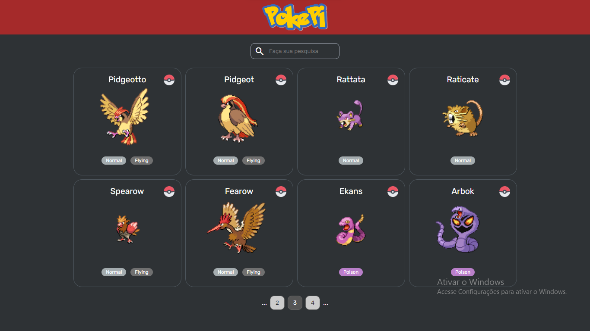

# Pokepi - WebProject
Pokepi é um projeto escolar desenvolvido em grupo para aprofundar o conhecimento sobre o funcionamento de APIs em aplicações web. Utilizamos diversas fontes e trabalhamos de forma colaborativa, com a equipe dividida entre o desenvolvimento do back-end (responsabilidade minha) e o front-end, onde destacamos Thalles, Gabriel e Lohan por suas contribuições eficazes no design e na responsividade da página.
O projeto consolidou meu conhecimento com React, Axios, bibliotecas e abstração de páginas utilizando API.

## Referências
- Documentação da API: [PokeAPI](https://pokeapi.co/)
- Documentação da API (v2): [PokeAPI v2](https://pokeapi.co/docs/v2)
